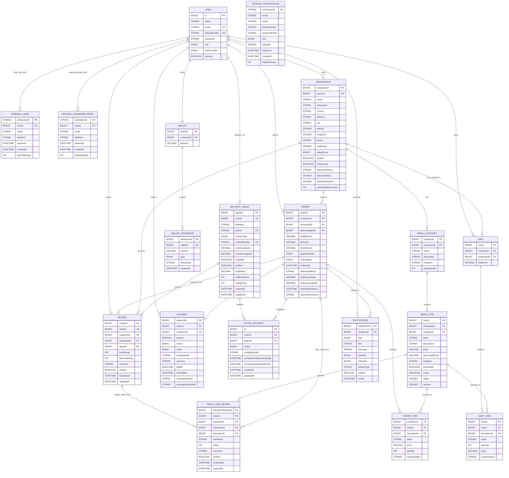

# PracticeRepository
# QuickBite ER Diagram

This project uses microservices, so each service owns its own schema.  
The diagram below is a single system-wide logical ERD that combines:

- physical table relationships inside a service
- logical cross-service references stored as IDs like `customerId`, `restaurantId`, `orderId`, and `agentId`

## Single System ERD

## How To Explain It

- `Auth`, `Cart`, `Order`, `Payment`, `Delivery`, `Review`, `Restaurant`, `Menu`, and `Notification` are separate microservice databases.
- Some links are true table relationships, like:
  - `MENU_CATEGORY -> MENU_ITEM`
  - `ORDER -> ORDER_ITEM`
  - `WALLET -> WALLET_STATEMENT`
- Many other links are logical cross-service references represented by IDs, for example:
  - `ORDER.customerId -> USER.id`
  - `RESTAURANT.ownerId -> USER.id`
  - `PAYMENT.orderId -> ORDER.orderId`
  - `ACTIVE_DELIVERY.agentId -> DELIVERY_AGENT.agentId`

## Short Viva Line

If someone asks why this is a logical ERD instead of one strict database ERD, you can say:

> QuickBite follows microservices architecture, so each service owns its own schema.  
> This ER diagram represents the full business data model by combining service-local tables and cross-service ID references in one view.
